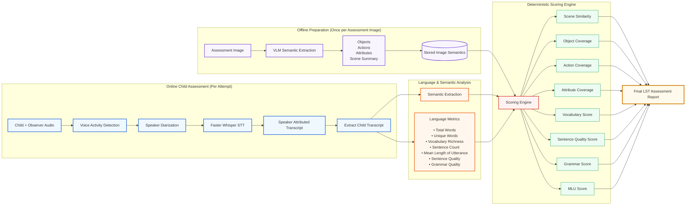
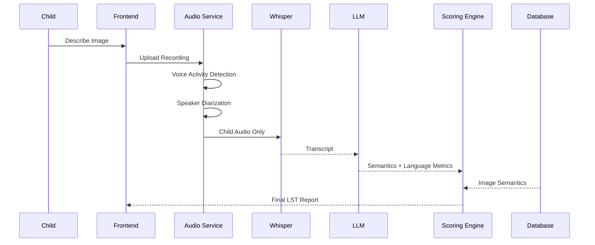
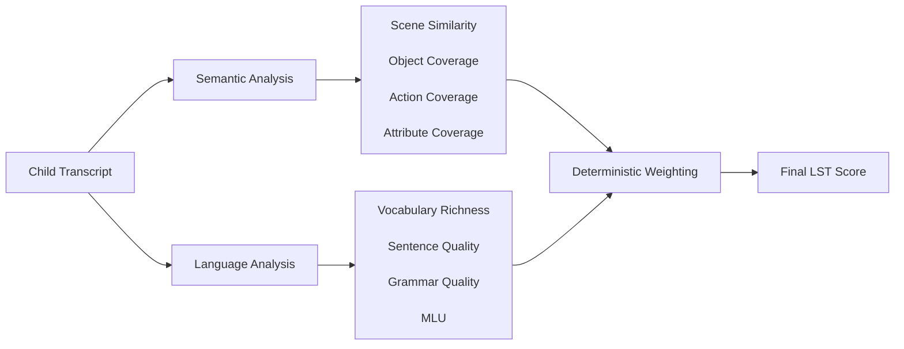

# Language Sampling Task (LST)

## Technical Architecture, Scoring Methodology & Implementation Guide

---

# Overview

The **Language Sampling Task (LST)** evaluates a child's expressive language abilities by asking them to describe an assessment image in their preferred language.

Unlike traditional language tests that depend on a specific language, the proposed system evaluates **meaning rather than wording**, making it suitable for multilingual environments.

The system measures two major capabilities:

1. **Semantic Understanding**

   * Can the child correctly identify and describe what is happening in the picture?

2. **Expressive Language**

   * How well can the child communicate those observations?

The architecture is designed to be:

* Language independent
* Low operational cost
* Explainable
* Modular
* Scalable for large deployments
* Suitable for a single developer while remaining production-ready

---

# Design Goals

The architecture follows several principles.

## 1. Language Agnostic

Children may speak in:

* English
* Hindi
* Tamil
* Bengali
* Telugu
* Urdu
* Mixed languages

The evaluation should remain identical regardless of language.

---

## 2. Deterministic Scoring

The LLM is responsible for **understanding language**, not assigning scores.

All scores are computed deterministically by the scoring engine.

---

## 3. Offline Image Processing

Assessment images never change.

Therefore image understanding should happen only once.

Image semantics are cached and reused.

---

## 4. Modular Components

Each component performs one responsibility.

```text
Audio
 ↓

Speaker Separation
 ↓

Speech Recognition
 ↓

Language Analysis
 ↓

Semantic Analysis
 ↓

Scoring Engine
```

Every module can later be replaced independently.

---

# Complete System Architecture




# Assessment Sequence Diagram

This shows the runtime flow.




# Scoring Pipeline Diagram

This clearly explains how the final score is computed.

---

# Why Speaker Diarization?

This is the most important improvement over the previous architecture.

## The Problem

During assessment, the observer naturally speaks.

Example

```text
Observer:
Can you tell me what you see?

Child:
A boy.

Observer:
What is he doing?

Child:
Playing football.
```

Without speaker separation, Whisper produces

```text
Can you tell me what you see?

A boy.

What is he doing?

Playing football.
```

Now the system incorrectly believes

* "Can"
* "Tell"
* "What"
* "Doing"

were spoken by the child.

Vocabulary becomes inflated.

Sentence complexity increases.

Semantic score becomes inaccurate.

---

## Solution

Introduce a Speaker Diarization stage.

Output

```text
Speaker A
Can you tell me what you see?

Speaker B
A boy.

Speaker A
What is he doing?

Speaker B
Playing football.
```

Only Speaker B is analyzed.

Adult speech is discarded.

This scales far better than trying to manually filter prompts.

---

# Technology Stack

| Component                | Recommended            |
| ------------------------ | ---------------------- |
| Voice Activity Detection | Silero VAD             |
| Speaker Diarization      | Pyannote               |
| Speech-to-Text           | Faster Whisper         |
| LLM                      | Groq / OpenAI / Gemini |
| Embeddings               | text-embedding-3-small |
| Backend                  | FastAPI / Next.js API  |
| Database                 | PostgreSQL             |
| Audio Storage            | S3 / Cloudflare R2     |

---

# Assessment Flow

## Step 1

Child opens assessment.

---

## Step 2

Assessment image appears.

Example

The image contains

* Boy
* Football
* Dog
* Park
* Sunny weather

---

## Step 3

Child describes image.

Example

Hindi

```
Ek ladka football khel raha hai.
Uske paas ek kutta bhi hai.
```

---

## Step 4

Audio recorded.

---

## Step 5

Voice Activity Detection removes silence.

---

## Step 6

Speaker Diarization separates speakers.

Example

```
Speaker A
Look carefully.

Speaker B
Ek ladka football khel raha hai.

Speaker A
Anything else?

Speaker B
Ek kutta bhi hai.
```

---

## Step 7

Extract child transcript only.

```
Ek ladka football khel raha hai.

Ek kutta bhi hai.
```

Adult speech removed completely.

---

## Step 8

Faster Whisper transcribes

```json
{
    "language":"hi",
    "transcript":"Ek ladka football khel raha hai. Ek kutta bhi hai."
}
```

---

## Step 9

LLM extracts normalized semantics.

Output

```json
{
    "objects":[
        "boy",
        "football",
        "dog"
    ],

    "actions":[
        "playing"
    ],

    "attributes":[

    ],

    "sceneSummary":"A boy is playing football with a dog nearby."
}
```

Notice everything becomes English.

This makes scoring language independent.

---

# Offline Image Processing

Every assessment image is processed only once.

Example image

Boy playing football.

Generated semantics

```json
{
    "imageId":"001",

    "objects":[
        "boy",
        "football",
        "dog",
        "park"
    ],

    "actions":[
        "playing"
    ],

    "attributes":[
        "daytime",
        "outdoor"
    ],

    "sceneSummary":"A boy is playing football with his dog in a park during daytime."
}
```

Stored forever.

Never regenerated.

---

# Semantic Evaluation

The scoring engine compares

Expected

vs

Detected

---

## Object Coverage

Expected

```
Boy
Football
Dog
Park
```

Detected

```
Boy
Football
Dog
```

Formula

```
Coverage

=

Matched Objects

/

Expected Objects
```

```
3 / 4

=

75%
```

---

## Action Coverage

Expected

```
Playing
```

Detected

```
Playing
```

```
1 / 1

=

100%
```

---

## Attribute Coverage

Expected

```
Daytime

Outdoor
```

Detected

```
Outdoor
```

```
1 / 2

=

50%
```

---

## Scene Similarity

Expected

```
A boy is playing football with a dog in a park.
```

Detected

```
A boy is playing football.
A dog is nearby.
```

Generate embeddings.

Compute cosine similarity.

Example

```
Similarity

=

0.91

=

91%
```

---

# Expressive Language Analysis

Semantic correctness alone does not measure language ability.

The transcript also undergoes linguistic analysis.

---

# 1. Total Words

Example

```
The boy is playing football.

The dog is running.
```

Total

```
10 words
```

---

# 2. Unique Words

Words

```
boy

boy

football

football

dog
```

Unique

```
boy

football

dog
```

Unique words

```
3
```

---

# 3. Vocabulary Richness

Measured using Type Token Ratio

Formula

```
Unique Words

/

Total Words
```

Example

```
Unique

20

Total

40

TTR

=

0.50
```

Higher ratio indicates richer vocabulary.

---

# 4. Sentence Count

Transcript

```
Boy.

Boy running.

The boy is playing football.

The dog is running.
```

Sentences

```
4
```

---

# 5. Average Words Per Sentence

Formula

```
Total Words

/

Sentence Count
```

Example

```
24 words

4 sentences

Average

6 words
```

---

# 6. Mean Length of Utterance (MLU)

Widely used clinical measure.

Formula

```
Total Words

/

Utterances
```

Example

```
36 words

6 utterances

MLU

6
```

---

# 7. Sentence Quality

Each utterance is classified.

Possible categories

| Type              | Example                                          |
| ----------------- | ------------------------------------------------ |
| Single Word       | "Dog"                                            |
| Phrase            | "Big dog"                                        |
| Simple Sentence   | "The dog is running."                            |
| Compound Sentence | "The boy runs and the dog follows."              |
| Complex Sentence  | "The boy is running because the dog chased him." |

The report includes percentages for each category.

---

# 8. Grammar Quality

Each utterance receives one label.

Possible labels

* Complete sentence
* Fragment
* Incomplete
* Repetition
* Unintelligible

---

# 9. Repetition Detection

Example

```
Dog.

Dog.

Dog.

Dog.
```

Repetition rate

```
80%
```

Useful for expressive language assessment.

---

# 10. Off-topic Speech

Example

```
I went to grandma's house yesterday.
```

The LLM marks

```
Off-topic
```

Off-topic content is ignored during semantic scoring.

---

# Audio Quality Metrics

These are computed before transcription.

| Metric              | Description                    |
| ------------------- | ------------------------------ |
| Recording duration  | Total recording time           |
| Speech duration     | Active speech only             |
| Silence percentage  | Long pauses                    |
| Child speaking time | Percentage                     |
| Adult speaking time | Percentage                     |
| Overlapping speech  | Child and adult simultaneously |
| Background noise    | Noise estimate                 |

These metrics help identify poor-quality recordings.

---

# Scoring Components

## Semantic Score

| Component          | Weight |
| ------------------ | ------ |
| Scene Similarity   | 35%    |
| Object Coverage    | 20%    |
| Action Coverage    | 15%    |
| Attribute Coverage | 10%    |

Total

```
80%
```

---

## Language Score

| Component                | Weight |
| ------------------------ | ------ |
| Vocabulary Richness      | 5%     |
| Sentence Quality         | 5%     |
| Grammar Quality          | 5%     |
| Mean Length of Utterance | 5%     |

Total

```
20%
```

---

# Final Score Formula

Example

Scene Similarity

```
91
```

Object Coverage

```
75
```

Action Coverage

```
100
```

Attribute Coverage

```
50
```

Vocabulary

```
80
```

Sentence Quality

```
70
```

Grammar

```
85
```

MLU

```
75
```

Calculation

```
(91 × 0.35)

+

(75 × 0.20)

+

(100 × 0.15)

+

(50 × 0.10)

+

(80 × 0.05)

+

(70 × 0.05)

+

(85 × 0.05)

+

(75 × 0.05)
```

```
31.85

+

15

+

15

+

5

+

4

+

3.5

+

4.25

+

3.75
```

Final

```
82.35 / 100
```

---

# Example Assessment Report

```
Language : Hindi

Recording Duration
42 sec

Speech Duration
31 sec

Adult Speech
12%

Child Speech
88%

--------------------------------

Semantic Metrics

Scene Similarity
91%

Object Coverage
75%

Action Coverage
100%

Attribute Coverage
50%

--------------------------------

Language Metrics

Total Words
48

Unique Words
31

Vocabulary Richness
65%

Sentence Count
8

Average Words/Sentence
6

MLU
5.8

Sentence Types

Simple
62%

Phrase
25%

Single Word
13%

Grammar Quality
82%

Repetition
5%

--------------------------------

Overall LST Score

82.35 / 100
```

---

# Why This Architecture Scales

This design cleanly separates responsibilities into independent modules:

* **Speaker Diarization** isolates the child's speech and removes observer influence.
* **Speech-to-Text** converts only the child's audio into text.
* **Language Analysis** computes linguistic metrics such as vocabulary richness, sentence quality, and MLU.
* **Semantic Analysis** extracts language-independent concepts and compares them with the precomputed image semantics.
* **Deterministic Scoring Engine** combines all metrics using configurable weights without relying on subjective LLM scoring.

Because every component is modular, individual services can be upgraded or replaced independently. This makes the system straightforward to build as a solo developer today while remaining scalable for production deployments handling thousands of assessments.
