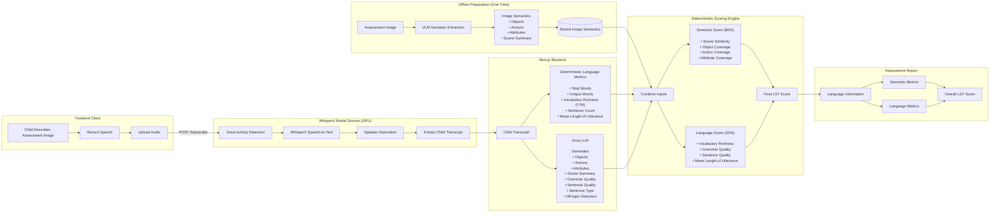

# Complete System Architecture

```mermaid
flowchart LR

%% ===============================
%% Offline Preparation
%% ===============================

subgraph OFFLINE["Offline Preparation (One-Time)"]
direction TB

A[Assessment Image]
B[VLM Semantic Extraction]
C["Image Semantics<br/>• Objects<br/>• Actions<br/>• Attributes<br/>• Scene Summary"]
D[(Stored Image Semantics)]

A --> B --> C --> D

end

%% ===============================
%% Frontend
%% ===============================

subgraph CLIENT["Frontend Client"]

direction TB

E[Child Describes Assessment Image]
F[Record Speech]
G[Upload Audio]

E --> F --> G

end

%% ===============================
%% WhisperX Modal Service
%% ===============================

subgraph MODAL["WhisperX Modal Service (GPU)"]

direction TB

H[Voice Activity Detection]
I[WhisperX Speech-to-Text]
J[Speaker Diarization]
K[Extract Child Transcript]

H --> I --> J --> K

end

%% ===============================
%% Backend
%% ===============================

subgraph BACKEND["Next.js Backend"]

direction TB

L[Child Transcript]

M["Deterministic Language Metrics<br/><br/>• Total Words<br/>• Unique Words<br/>• Vocabulary Richness (TTR)<br/>• Sentence Count<br/>• Mean Length of Utterance"]

N["Groq LLM<br/><br/>Generates<br/>• Objects<br/>• Actions<br/>• Attributes<br/>• Scene Summary<br/>• Grammar Quality<br/>• Sentence Quality<br/>• Sentence Type<br/>• Off-topic Detection"]

L --> M
L --> N

end

%% ===============================
%% Scoring Engine
%% ===============================

subgraph SCORE["Deterministic Scoring Engine"]

direction TB

O[Combine Inputs]

P["Semantic Score (80%)<br/><br/>• Scene Similarity<br/>• Object Coverage<br/>• Action Coverage<br/>• Attribute Coverage"]

Q["Language Score (20%)<br/><br/>• Vocabulary Richness<br/>• Grammar Quality<br/>• Sentence Quality<br/>• Mean Length of Utterance"]

R["Final LST Score"]

O --> P
O --> Q

P --> R
Q --> R

end

%% ===============================
%% Report
%% ===============================

subgraph REPORT["Assessment Report"]

direction TB

S["Language Information"]

T["Semantic Metrics"]

U["Language Metrics"]

V["Overall LST Score"]

S --> T
S --> U
T --> V
U --> V

end

%% ===============================
%% Connections
%% ===============================

G -->|POST /transcribe| H

K --> L

D --> O
M --> O
N --> O

R --> S
```
